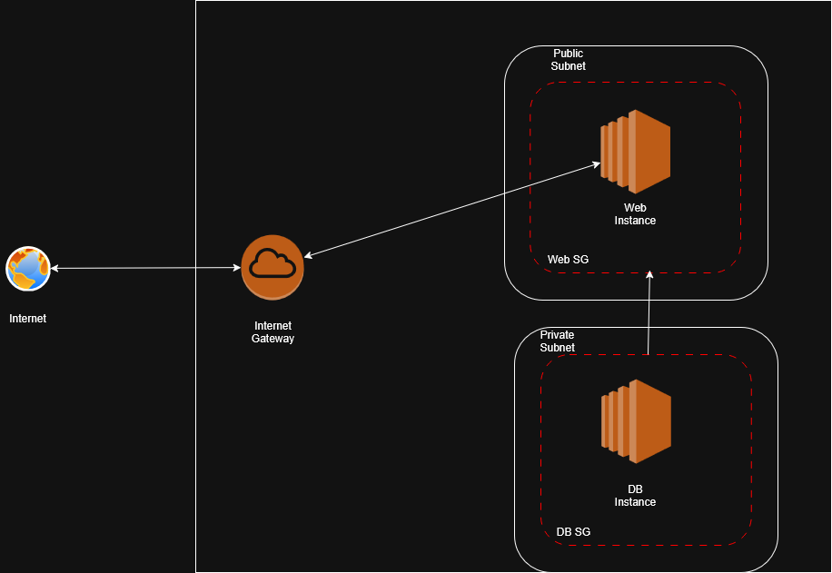

# 🌄 Project Overview

This project builds off of a built-from-scratch VPC project (cloud-project-one) using AWS, and a project that uses boto3 and the python programming language to interact with AWS (cloud-project-two). They can be found below and used for reference when:

- Configuring WSL (Windows Subsystem for Linux)
- Configuring the AWS CLI
- Configuring Python
- Configuring boto3
- Configuring the Virtual Environment used when working with boto3
- Creating VPC components using the AWS Console and CLI


Fix this w/ copy paste from version on home pc

# ⚙️ Tools & Technologies

| Layer         | Tech Stack       | Purpose                                      |
|---------------|------------------|----------------------------------------------|
| Web Server    | Python + Flask   | Handles form input and HTML output           |
| Frontend      | HTML + CSS       | Builds the UI: input, button, output table   |
| Backend       | Flask (Python)   | Logic + DB interactions                      |
| Database      | MySQL on EC2     | Stores guestbook entries                     |
| Infrastructure| AWS EC2 (2x)     | Web + DB tiers                               |
| Deployment    | Manual (SSH)     | SSH + install packages via CLI               |
| Security      | Security Groups  | HTTP/SSH for web, 3306 from web-only         |

# 📜 Diagrams




# 🏗️ Design Rationale

This project emulates a simple professional networking environment. 

It is a two-tier Guestbook sign-in application built on AWS VPC networking infrastructure with isolated hosts, subnets, and security groups being used
for logical separation and security purposes.

Database hosting utilizes mySQL on an EC2 instance, while web services and database interactions are handled by a Python framework called Flask.

# 🔧 Setup

## Prerequisites

This project assumes that you've already completed "cloud-project-two" linked in the "Project Overview" section.

For the sake of conserving resources, you'll be reusing the VPC and subnets from that project. Before starting the 
"Create Security Groups" section be certain that you have:

- A VPC
- A public subnet with:
    - Automatic public IPv4 address assignment
- A private subnet
- Internet Gateway
- Route Table

// The internet gateway has to be attached to something, rather the something has to have an internet 
gateway attached, I believe. I'm pretty sure this gets attached to the VPC to allow internet traffic 
to happen. I need to clarify this.

## Create Security Groups

In your WSL Ubuntu bash shell, type:

```bash
nano create_sg.py
```

paste in the following:

```bash
import boto3

# CONFIGURE THIS SECTION
SECURITY_GROUP_NAME = "web-sg"
DESCRIPTION = "Security group for web tier (HTTP + SSH)"
VPC_ID = "vpc-040fca4e38b58d593"  # <-- Replace with your actual VPC ID
REGION = "us-east-1" #<--- Replace with your actual region

# Initialize EC2 client
ec2 = boto3.client('ec2', region_name=REGION)

# Create the security group
response = ec2.create_security_group(
    GroupName=SECURITY_GROUP_NAME,
    Description=DESCRIPTION,
    VpcId=VPC_ID,
    TagSpecifications=[
        {
            'ResourceType': 'security-group',
            'Tags': [
                {'Key': 'Name', 'Value': SECURITY_GROUP_NAME},
                {'Key': 'Project', 'Value': '2-tier-app'}
            ]
        }
    ]
)

security_group_id = response['GroupId']
print(f"Created security group with ID: {security_group_id}")

# Add inbound rules (HTTP and SSH)
ec2.authorize_security_group_ingress(
    GroupId=security_group_id,
    IpPermissions=[
        {
            'IpProtocol': 'tcp',
            'FromPort': 80,
            'ToPort': 80,
            'IpRanges': [{'CidrIp': '0.0.0.0/0', 'Description': 'Allow HTTP'}]
        },
        {
            'IpProtocol': 'tcp',
            'FromPort': 22,
            'ToPort': 22,
            'IpRanges': [{'CidrIp': '0.0.0.0/0', 'Description': 'Allow SSH'}]
        }
    ]
)

print("Inbound rules added.")
```

Once that script is entered into the file and you've filled in your information, save and exit nano, then run the script using:

```bash
python3 create_sg.py
```


We'll now create the other security group for the database tier. This is mostly just a few modifications on the script used for the 
web security group. 

Open a new nano file:

```bash
nano create_sg2.py
```

Paste in the following:

```bash
import boto3

# CONFIGURE THIS SECTION
SECURITY_GROUP_NAME = "cp3-db-sg"
DESCRIPTION = "Security group for db tier (MySQL + SSH)"
VPC_ID = "vpc-abcdefgh1234567"  # Replace with your actual VPC ID
REGION = "us-east-2"
WEB_SECURITY_GROUP_ID = "sg-xxxxxxxxxxxxxxxxx"  # Replace with actual Web SG ID

# Initialize EC2 client
ec2 = boto3.client('ec2', region_name=REGION)

# Create the security group
response = ec2.create_security_group(
    GroupName=SECURITY_GROUP_NAME,
    Description=DESCRIPTION,
    VpcId=VPC_ID,
    TagSpecifications=[
        {
            'ResourceType': 'security-group',
            'Tags': [
                {'Key': 'Name', 'Value': SECURITY_GROUP_NAME},
                {'Key': 'Project', 'Value': '2-tier-app'}
            ]
        }
    ]
)

security_group_id = response['GroupId']
print(f"Created security group with ID: {security_group_id}")

# Add inbound rules
ec2.authorize_security_group_ingress(
    GroupId=security_group_id,
    IpPermissions=[
        {
            'IpProtocol': 'tcp',
            'FromPort': 3306,
            'ToPort': 3306,
            'UserIdGroupPairs': [
                {
                    'GroupId': WEB_SECURITY_GROUP_ID,
                    'Description': 'Allow MySQL from web SG'
                }
            ]
        },
        {
            'IpProtocol': 'tcp',
            'FromPort': 22,
            'ToPort': 22,
            'IpRanges': [
                {'CidrIp': '207.223.37.25/32', 'Description': 'Allow SSH'}
            ]
        }
    ]
)

print("Inbound rules added.")
```

## Create the EC2 instances

Now that we've created our security groups, let's generate the instances for our web delivery and database.

### Creating the Web Server

In the following scripts you'll have to fill in your own security group, subnet, and key pair information. 
There will be an AMI id included, but if you're looking for a newer one, you can use the get_ami.py script
found in the scripts folder in the github repository.

Now, type

```bash
nano create_web_ec2.py
```

and paste in the following script:

```bash
#!/usr/bin/env python3

import boto3

# Replace these with real, working values from your setup
AMI_ID = 'ami-0ddac208607ae06a0'  # Amazon Linux 2
INSTANCE_TYPE = 't2.micro'
KEY_NAME = 'my-key-pair'
SECURITY_GROUP_IDS = ['sg-abcdefgh1234567']
SUBNET_ID = 'subnet-abcdefgh1234567'

def launch_instance():
    ec2 = boto3.client('ec2')

    response = ec2.run_instances(
        ImageId=AMI_ID,
        InstanceType=INSTANCE_TYPE,
        KeyName=KEY_NAME,
        MaxCount=1,
        MinCount=1,
        SecurityGroupIds=SECURITY_GROUP_IDS,
        SubnetId=SUBNET_ID,
        TagSpecifications=[
            {
                'ResourceType': 'instance',
                'Tags': [{'Key': 'Name', 'Value': 'Python-Launched-Instance'}]
            }
        ]
    )

    instance_id = response['Instances'][0]['InstanceId']
    print(f"Launched instance with ID: {instance_id}")

if __name__ == "__main__":
    launch_instance()
```
You can adjust the name in the AWS console, or id the tagspecifications section in the script if you'd like.
My instance is called cp3-guestbook-web. Now, we'll move towards creating the database server.

### Creating the Database Server

Creating the database server is nearly identical to creating the web server, except for the security group and subnets that will be attached. We want the web server on a public subnet and the database on a private one. 

In your Ubuntu bash shell: 

Type:

```bash
nano create_db_ec2.py
```

now paste in the following:

```bash

#!/usr/bin/env python3

import boto3

# Replace these with real, working values from your setup
AMI_ID = 'ami-0ddac208607ae06a0'  # Amazon Linux 2
INSTANCE_TYPE = 't2.micro'
KEY_NAME = 'my-key-pair'
SECURITY_GROUP_IDS = ['sg-abcdefgh1234567']
SUBNET_ID = 'subnet-abcdefgh1234567'

def launch_instance():
    ec2 = boto3.client('ec2')

    response = ec2.run_instances(
        ImageId=AMI_ID,
        InstanceType=INSTANCE_TYPE,
        KeyName=KEY_NAME,
        MaxCount=1,
        MinCount=1,
        SecurityGroupIds=SECURITY_GROUP_IDS,
        SubnetId=SUBNET_ID,
        TagSpecifications=[
            {
                'ResourceType': 'instance',
                'Tags': [{'Key': 'Name', 'Value': 'Python-Launched-Instance'}]
            }
        ]
    )

    instance_id = response['Instances'][0]['InstanceId']
    print(f"Launched instance with ID: {instance_id}")

if __name__ == "__main__":
    launch_instance()

```

now run the script in the terminal by typing:

```bash
python3 create_db_ec2.py
```

## Configuring the Database Server

Doing this requires some tricks because, for security reasons, our database server will not have a public 
IP address. To access it, we'll be connecting to our web ec2, and then jumping from there to connect to
the db ec2.

To do this, we'll first use ssh to connect to our web ec2. Before connecting to the instance, open your ssh private key ( a file ending in .pem), and copy the contents of that file to a notepad document. 

You're going to need to copy this to the ssh key section of the web instance to allow you to jump into the database instance. For security sake, probably don't save the notepad doucment. 

If this key is compromised, it can potentially be used to access your EC2 by outside parties, which is is definitely undesirable. 

Assuming that your key pairs and security groups are appropriately configured, the following command will get you into the web EC2:

```bash

ssh -i /path/to/ssh-key-file ec2-user@WEB_EC2_IP_ADDRESS

```

There are a few ways this can go wrong so be mindful. The most obvious ones will be:

- SSH not being allowed on your web instance's security group
- Not appropriately typing the ssh key path

Once you're into the database EC2 instance, create a .pem using nano. For the sake of simplicity, I recommend using the same key pair 
and file names for both instances.

```bash
nano my-key-pair.pem
```

Paste in the contents that you haved saved to the notepad document to the side.

Assuming all of these steps worked, and you have appropriately configured the inbound rules of your database's security group, you are
now ready to use SSH to jump into the database instance. 

Use the following command:

```bash
ssh -i path/to/ssh-key ec2-user@db-instance-private-ip-address
```

If everything went as expected you should now be connected to the database instance and ready to set up mySQL.

# 🎥 Demo

!!! PENDING !!!

# 🤔 Reflections

I returned to this project in an effort to create a more standardized workflow process and found that while I have a reasonably 
good understanding of everything I'm doing, execution can still be choppy. 

Some mild pain points:

- Diagrams and documentation 

- Technical processes, even when well understood can still have small execution errors that prompt troubleshooting. In the 
case of crafting networks it seems that fishing out little errors is likely the norm. 

# 🌦️ Future Feature Forecasting

There are many features that could be added, but the first two would likely be moving to HTTPS and utilizing Network Address 
Translation. 

After that DDOS protection, but the app would have to be significantly more complex to before worrying about those, and this is 
not primarily an exercise in frontend or backend app development. 

# 🧭 Changes in Approach

The value of standardizing from project-to-project in order to make iteration fast and simple has become very obvious.

Returning to the project to finish leftover work makes it very glaring that you want to avoid leaving anything leftover whenever
possible because it takes 5x-10x as long to remember what you were doing even if you understand the concepts and skills well. This
means that I better knock out the video as I'm doing or immediately after projects even if I dread doing so. 


